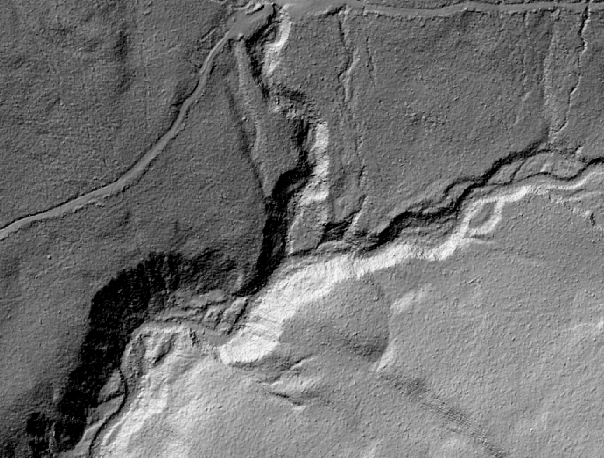

wb_denoise
==========

Description
-----------

This repository contains code that implements Sun's 2007 (*Fast and Effective Feature-Preserving Mesh Denoising*) [de-noising algorithm](https://github.com/exuberant/mdenoise), intented for application with raster digital elevation models (DEMs). The algorithm has been implemented using the [Nim programming language](https://nim-lang.org). The implementation has been modified in the following ways:

1. The algorithm assumes that the underlying data structure is a raster rather than a TIN.
2. Normal vectors are calculated planes fit to the 3x3 neighbourhood surrounding each grid cell rather than triangular facets.
3. A convolution filter is used to smooth the normal vector field rather than iteration.
4. The user inputs the normal vector deviation angle threshold in degrees rather than a cosine angle.
5. The method for updating elevations differs from Sun's method.
6. The user may optional specify a weighting scheme for normal vector smoothing that uses either Sun's original method (ni . nj - T) or a simple thresholded mean filter (i.e. all neighbouring grid cells with normal vectors that deviate from the centre cell by less than the threshold are given equal weighting). This both increases the efficiency and the degree of smoothing.

These modifications generally result in more efficient denoising. The algorithm has been demonstrated to work well with fine-resolution LiDAR data. Note that the input DEM should be in a projected coordinate system (e.g. UTM) and in a [Whitebox GAT](http://www.uoguelph.ca/~hydrogeo/Whitebox/) raster format.

Installing
----------

After downloading the source code in the repository and installing the [Nim compiler](https://nim-lang.org/install.html) on your computer, open a terminal (command prompt), change the working directory to the folder containing the source code and type the following:

```
>> nim c -d:release wb_denoise.nim
```

Usage
-----

| flag         | Description                                              |
|--------------|----------------------------------------------------------|
| --wd         |  Working directory; appended to input/output file names  |
| -i, --input  |  Input DEM file name                                     |
| -o, --output |  Output DEM file name                                    |
| --threshold  |  Threshold value in degrees (1.0 - 85.0)                 |
| --filter     |  Filter size for normal smoothing (odd value >3)         |
| --iterations |  Number of iterations used for elevation updating        |
| --hillshade  |  Optional output hillshade image file name               |
| -m           |  If this flag is present, a simple mean filter is used   |
| -h           |  Help                                                    |

Example usage at command line (>>):

```
>> ./wb_denoise --wd="/path/to/data/" -i="DEM file.dep" -o=output.dep --threshold=20.0 --filter=5 --iterations=8 --hillshade=hs.dep
```
Here is a sample of the effect of running the tool on a fine-resolution LiDAR DEM:


The above image is the hillshade image derived from the de-noised DEM using a threshold of 20-degrees, a 13 grid cell filter size, and 5 iterations of elevation updating. And here are some more detailed images:




Licence
-------

The MIT License (MIT)

References
----------

Sun X, Rosin PL, Martin RR, Langbein FC (2007) Fast and Effective Feature-Preserving Mesh Denoising. IEEE Transactions on Visualization and Computer Graphics, 13:925–938. doi: 10.1109/TVCG.2007.1065

Stevenson JA, Sun X, Mitchell NC (2010) Despeckling SRTM and other topographic data with a denoising algorithm. Geomorphology 114:238–252. doi: 10.1016/j.geomorph.2009.07.006
