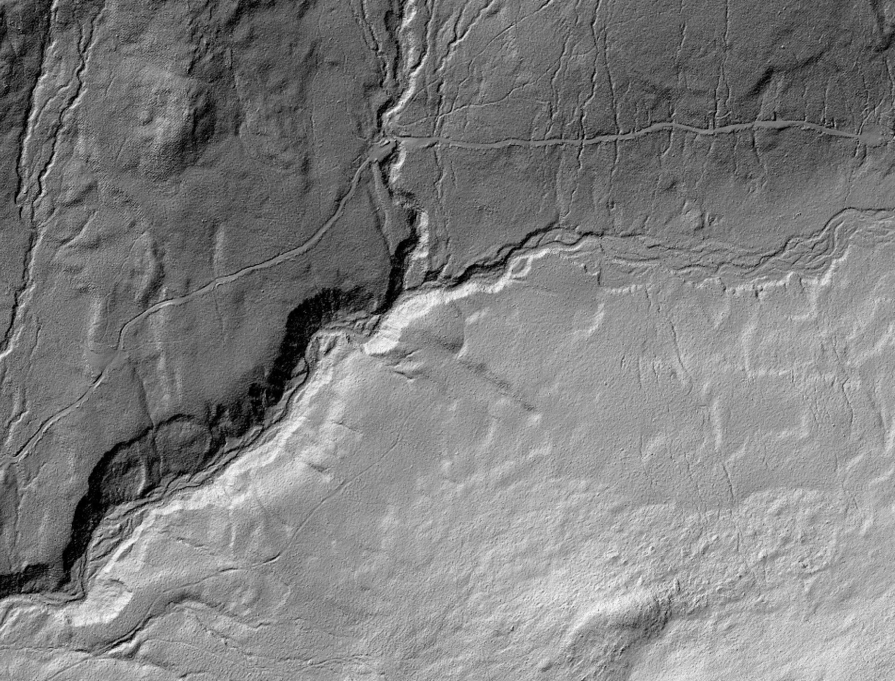

fp_denoise
==========

Description
-----------

*fp_denoise* is a command-line program for performing feature-preserving de-noising, intented for application with raster digital elevation models (DEMs). It is a modified implementation of Sun's 2007 (*Fast and Effective Feature-Preserving Mesh Denoising*) [de-noising algorithm](https://github.com/exuberant/mdenoise). The algorithm has been developed using the [Nim programming language](https://nim-lang.org). The implementation has been modified in the following ways:

- The algorithm assumes that the underlying data structure is a raster rather than a TIN.
- Normal vectors are calculated planes fit to the 3x3 neighbourhood surrounding each grid cell rather than triangular facets.
- The normal vector field is smoothed using a convolution filter rather than iteration.
- The user inputs the normal vector deviation angle threshold in degrees rather than a cosine angle.
- The method for updating elevations differs from Sun's method.
- The user may optional specify a weighting scheme for normal vector smoothing that uses either Sun's original method (ni . nj - T) or a simple thresholded mean filter (i.e. all neighbouring grid cells with normal vectors that deviate from the centre cell by less than the threshold are given equal weighting). This both increases the efficiency and the degree of smoothing.
- There is an optional hillslope raster input that ensure there is no smoothing across channels and drainage divides. A hillslope raster can be created using the *Hillslopes* tool in [*WhiteboxTools*](https://github.com/jblindsay/whitebox-geospatial-analysis-tools/tree/master/whitebox_tools) based on a D8 flow direction raster and a raster streams file (also derived using WhiteboxTools).
- There is an optional shaded relief raster output.

These modifications generally result in more efficient denoising. The algorithm has been demonstrated to work well with fine-resolution LiDAR data. Note that the input DEM should be in a projected coordinate system (e.g. UTM) and in a [Whitebox GAT](http://www.uoguelph.ca/~hydrogeo/Whitebox/) or ArcGIS ASCII raster format.

The general workflow of the method is divided into three components:

1. A normal vector is calculated for each grid cell in the input DEM based on the eight neighbouring cells in the 3 x 3 neighbourhood.

2. The normal vector field is smoothed using a low-pass filtering technique that preserves features, or breaks in slope, by excluding neighbours that have differences in normal vectors from the centre-cell vector by more than a user-specified threshold. The size of the convolution filter kernel is also specified by the user. In addition to excluding neighbours with differences in normal vector angle larger than the specified threshold, if the optional hillslope image is input, then neighbours with hillslope ID values different from that of the centre cell will be excluded during the smoothing process. This ensures that smoothing does not occur across channels and drainage divides.

3. The smoothed normal vector field is used to update the elevations in the output DEM using an iterative process.

Although the algorithm, like Sun's mdenoise, is currently single-threaded, there is potential to parallelize Steps 1 and 2 in the above workflow. Future versions will likely add this feature to further enhance algorithm efficiency. 

Installing
----------

After downloading the source code in the repository and installing the [Nim compiler](https://nim-lang.org/install.html) on your computer, open a terminal (command prompt), change the working directory to the folder containing the source code and type the following:

```
>> nim c -d:release fp_denoise.nim
```

Usage
-----

| flag                   | Description                                              |
|------------------------|----------------------------------------------------------|
| --wd                   |  Working directory; appended to input/output file names  |
| -i, --input            |  Input DEM file name                                     |
| -o, --output           |  Output DEM file name                                    |
| --hillslope, --hs      |  Optional input hillslope raster file name                     |
| --threshold            |  Threshold value in degrees (1.0 - 85.0)                 |
| --filter               |  Filter size for normal smoothing (odd value >3)         |
| --iterations           |  Number of iterations used for elevation updating        |
| --shaded_relief, --sr  |  Optional output hillshade image file name               |
| -m                     |  If this flag is present, a simple mean filter is used   |
| -h                     |  Help                                                    |

Example usage at command line prompt (>>):

```
>> ./fp_denoise --wd="/path/to/data/" -i="DEM file.dep" -o=output.dep --hs=hillslopes.dep --threshold=20.0 --filter=5 --iterations=8 --sr=shaded_relief.dep
```
Here is a sample of the effect of running the tool on a fine-resolution LiDAR DEM:




The above image is the hillshade image derived from the de-noised DEM using a threshold of 20-degrees, a 13 grid cell filter size, and 5 iterations of elevation updating. And here are some more detailed images:


Licence
-------

The MIT License (MIT)

References
----------

Stevenson JA, Sun X, Mitchell NC (2010) Despeckling SRTM and other topographic data with a denoising algorithm. Geomorphology 114:238–252. doi: 10.1016/j.geomorph.2009.07.006

Sun X, Rosin PL, Martin RR, Langbein FC (2007) Fast and Effective Feature-Preserving Mesh Denoising. IEEE Transactions on Visualization and Computer Graphics, 13:925–938. doi: 10.1109/TVCG.2007.1065
